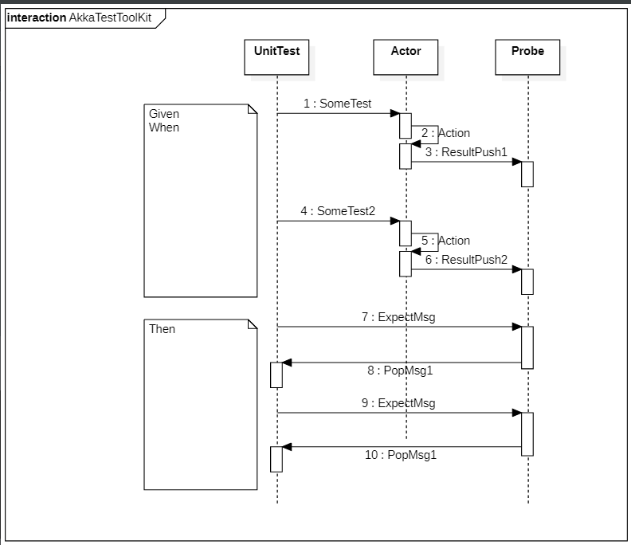
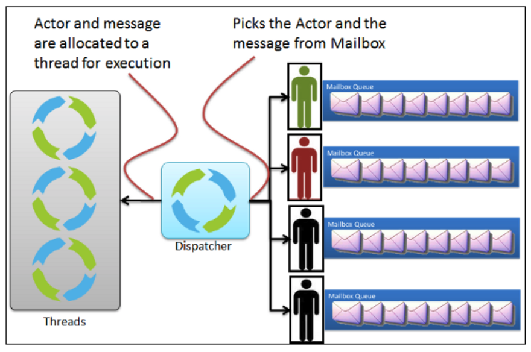

# AKKA(NetCore) Unit TEST

## Akka TestToolKit 컨셉

전통적 유닛테스트에서는 함수호출의 결과값을 기다려야하는 동기적 검사 위주로 작성되지만
이벤트 메시징 큐기반으로 작성된 모듈기반에서는 이러한 테스트 방식을 채택한다고 하면
작동중인 코드를 중단한후 검사해야하지만

액터의 특성을 이용 관찰자를 연결하여 관찰자의 메시지 검사를 통해 서비스 액터의 블락킹없이 유닛 테스트를 수행할수 있습니다.

    # hello 이벤트를 받으면, world를 반환하는 액터의 유닛검사 방법
    basicActor.Tell("hello"); 
    ExpectMsg("world");

## Dispacher

하나의 액터는 순차성을 보장합니다. 순차성이 아닌 병렬동시처리가 필요할시  멀티스레드 프로그래밍을 할 필요는 없지만
풀을 구성하고 스레드 옵션을 줄수가 있습니다. 이러한 액터의 실행계획은 Dispatcher가 관리하게됩니다.

