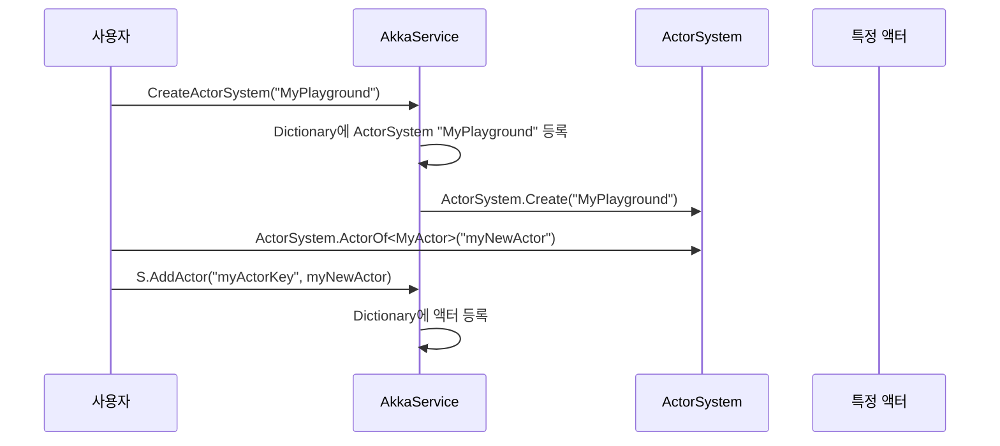

# Chapter 1: Akka 서비스

## 개요
“Akka 서비스”는 여러 개의 액터 시스템(ActorSystem)을 쉽고 편리하게 만들어 관리할 수 있도록 돕는 핵심적인 구성 요소입니다. 액터(actor)는 동시에 많은 일이 벌어지는 상황에서 각자 메시지를 주고받으며 일을 처리하는 작은 단위라고 생각하시면 됩니다. 예를 들어, 여러 명의 아이들이 모여 노는데, 운동장(액터 시스템)을 만들어 아이들을 서로 다른 운동장에 배치할 수 있고, 필요한 순간에 특정 아이(액터)를 불러낼 수도 있습니다. 이렇게 나누어 관리하면 복잡한 동시성 문제를 단순화시킬 수 있습니다.

여기서는 “Akka 서비스”가 무엇을 하는지, 왜 필요한지, 그리고 실제로 어떻게 사용하는지 간단한 예시와 함께 알아보겠습니다.

---

## 왜 “Akka 서비스”가 필요한가?
초보자 입장에서, 한 번에 모든 액터를 한 운동장 안에 몰아넣으면 쉽게 관리할 것 같지만, 점점 규모가 커지면 복잡해집니다. 새로운 기능을 추가하거나, 액터 간 충돌을 막아야 할 때 점점 골치 아파집니다. 그래서 필요한 만큼 운동장을 늘리고, 각 운동장마다 서로 다른 규칙(포트, 설정 등)을 적용할 수 있도록 지원해주는 것이 바로 “Akka 서비스”입니다.

### 주요 기능 한 눈에 보기
1. **ActorSystem 생성**: 원하는 이름과 포트로 새로운 액터 시스템을 동적으로 만듭니다.  
2. **기본 시스템 설정**: 필요하다면 기본(default) 시스템을 지정해둘 수도 있습니다.  
3. **액터 등록 및 조회**: 생성된 액터(아이)를 편하게 등록하고, 언제든지 다시 불러올 수 있습니다.  

---

## “Akka 서비스”를 간단히 살펴보기

### 핵심 클래스: AkkaService
“Akka 서비스” 구현의 중심에는 “AkkaService” 클래스가 있습니다. 이 클래스는 두 개의 `Dictionary`를 통해 액터 시스템과 액터를 저장하고 관리합니다.

아래 코드는 “AkkaService” 클래스 중 일부를 발췌한 예시입니다:

```csharp
public class AkkaService
{
    private Dictionary<string, ActorSystem> actorSystems = new Dictionary<string, ActorSystem>();
    private Dictionary<string, IActorRef> actors = new Dictionary<string, IActorRef>();

    // ...
}
```

여기서 `actorSystems`는 이름을 키로 하여 `ActorSystem`을 저장하고, `actors`는 특정 액터를 식별하는 키(이름)에 해당 `IActorRef`(액터 참조)를 매핑해둡니다.

---

### ActorSystem 생성하기
실제 운동장을 만드는 과정(ActorSystem 생성)은 `CreateActorSystem` 메서드가 담당합니다. 다음 예시는 필수 로직만 간단히 보여줍니다:

```csharp
public ActorSystem CreateActorSystem(string name, int port = 0)
{
    if (!actorSystems.ContainsKey(name))
    {
        if (port == 0)
        {
            // 기본 설정을 사용하여 ActorSystem 생성
            actorSystems[name] = ActorSystem.Create(name);
        }
        else
        {
            // 포트 지정 시 리모트 설정 반영
            string akkaConfig = @"
            akka {
                actor { provider = remote }
                remote {
                    dot-netty.tcp {
                        port = $port
                        hostname = ""127.0.0.1""
                    }
                }
            }";

            // $port를 실제 포트 번호로 치환
            akkaConfig = akkaConfig.Replace("$port", port.ToString());
            var config = ConfigurationFactory.ParseString(akkaConfig);

            actorSystems[name] = ActorSystem.Create(name, config);
        }
    }
    else
    {
        throw new Exception($"{name} actorsystem has already been created.");
    }

    return actorSystems[name];
}
```

#### 어떻게 동작하나요?
1. `name`이라는 키로 이미 생성된 액터 시스템이 있으면 예외를 발생시킵니다.  
2. 없으면 포트가 0인지 확인하고, 0이라면 “기본 설정”을 통해 운동장(ActorSystem)을 만듭니다.  
3. 포트 번호가 주어지면 네트워크 설정(예: 리모트 액터)을 허용하는 특별한 운동장을 만듭니다.

---

### 생성된 ActorSystem 활용하기
만들어진 액터 시스템에 액터를 등록하고 싶다면, 다음과 같은 방식을 사용할 수 있습니다.

```csharp
// 새로운 ActorSystem 생성
var actorSystem = myAkkaService.CreateActorSystem("MyPlayground");

// 액터 생성 후 등록
IActorRef myNewActor = actorSystem.ActorOf<MyActor>("myNewActor");
myAkkaService.AddActor("myActorKey", myNewActor);
```

이 코드에서 “`myAkkaService`”는 미리 만들어 둔 `AkkaService`의 인스턴스라고 가정합니다.  
- `"MyPlayground"`라는 이름의 운동장을 새로 만들었습니다.  
- `ActorOf<T>` 메서드를 통해 액터를 만들고, `"myNewActor"`라는 별칭을 부여했습니다.  
- 마지막으로 `AddActor` 메서드에 `"myActorKey"`를 키로 사용해 우리가 만든 액터를 등록합니다.

등록된 액터는 언제든 다음과 같이 다시 불러올 수 있습니다:

```csharp
var actorRef = myAkkaService.GetActor("myActorKey");
```

---

## 내부 동작 흐름 살펴보기

다음은 사용자가 새로운 액터를 만들고 등록할 때 벌어지는 간단한 순서를 나타낸 시퀀스 다이어그램입니다.



1. 사용자가 `CreateActorSystem`을 호출하면, “AkkaService”는 내부 `Dictionary`를 확인해 중복이 없는지 체크하고, 새 “ActorSystem”을 생성한 후 등록합니다.  
2. 사용자는 생성된 “ActorSystem”을 통해 액터를 생성합니다.  
3. 마지막으로 `AddActor`로 “AkkaService” 안에 해당 액터도 등록해두면, 필요한 시점에 바로 꺼내 쓸 수 있습니다.

---

## 내부 구현 조금 더 살펴보기
아래 작은 코드 조각들은 “AkkaService” 클래스에서 액터 등록과 조회를 담당하는 부분입니다.

```csharp
public void AddActor(string name, IActorRef actor)
{
    if (!actors.ContainsKey(name))
    {
        actors[name] = actor;
    }
}
```
- `actors`라는 Dictionary에 “이름”을 키로 하여 액터 참조(`IActorRef`)를 저장합니다.  
- 이미 동일한 키가 있으면 덮어쓰지 않도록 예외 처리를 하거나, 원하는 로직에 따라 동작시킬 수 있습니다.

```csharp
public IActorRef GetActor(string name)
{
    if (actors.ContainsKey(name))
    {
        return actors[name];
    }
    else
    {
        return null;
    }
}
```
- 이름으로 등록된 액터가 있는지 찾아보고, 있으면 해당 액터를 반환합니다.  
- 없다면 `null`을 반환합니다(실무에서는 예외 처리를 하는 등 상황에 맞는 로직을 추가하는 경우가 많습니다).

---

## 정리 및 다음 장으로
이 장에서는 “Akka 서비스”가 무엇이며 왜 필요한지, 그리고 기본적인 사용 방법을 살펴보았습니다.  
- 여러 액터 시스템을 자유롭게 만들고 포트를 설정할 수 있습니다.  
- 액터를 등록하고 필요할 때마다 간편하게 가져올 수 있습니다.  

이제 다양한 액터 구현 방법을 살펴볼 차례입니다. 다음 장에서는 [기본 액터(BasicActor)](02_기본_액터_basicactor__.md)를 살펴보며 실제 액터가 어떻게 메시지를 주고받는지 알아보겠습니다.  

---

Generated by [AI Codebase Knowledge Builder](https://github.com/The-Pocket/Tutorial-Codebase-Knowledge)