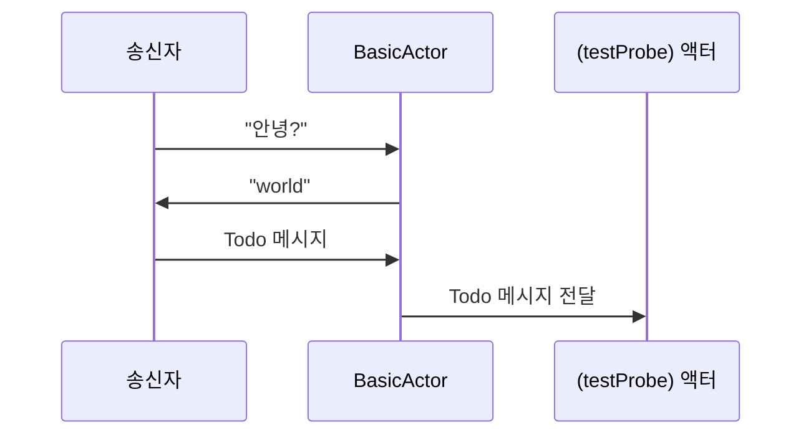

# Chapter 2: 기본 액터(BasicActor)

[이전 장: Akka 서비스](01_akka_서비스_.md)

이전 장에서 여러 액터 시스템을 만들고 관리하는 방법을 살펴보았습니다. 이제 실제로 액터가 어떤 식으로 메시지를 주고받으며 동작하는지 배워볼 차례입니다. 이번 장에서는 “기본 액터(BasicActor)”를 통해 메시지 처리의 가장 간단한 예시를 살펴보겠습니다.

---

## 왜 “기본 액터”가 필요할까요?

초급 단계에서 액터를 배울 때, 메시지를 어떻게 주고받는지 직관적으로 알 수 있는 예시가 필요합니다. “기본 액터(BasicActor)”는 다음과 같은 상황을 가정해 볼 수 있습니다:

- 친구에게 “안녕?”이라는 메시지를 보내듯이, 누군가 액터에게 메시지를 전달하면 그에 맞춰 대응하는 응답을 돌려주거나, 다른 액터 혹은 로거(Logger)에게 내용을 넘깁니다.  
- 이 과정을 통해 액터가 받은 메시지를 어떻게 처리하고, 어떤 결과를 만드는지 직접 확인해볼 수 있습니다.

예를 들어, 누군가가 “BasicActor”에게 “안녕?”(string 타입 메시지)을 보내면, 이 액터는 “world”라는 답을 보낸다고 생각해보세요. 단순해 보이지만, 이 작은 단위에서 액터가 어떻게 반응해야 하는지를 배울 수 있습니다.

---

## 기본 개념 살펴보기

“기본 액터(BasicActor)”는 Akka.NET의 “ReceiveActor”를 상속하여 만들어집니다. “ReceiveActor”는 메시지 타입에 따라 해당 메시지를 처리하는 로직을 손쉽게 구성할 수 있도록 해줍니다.

다음은 “BasicActor”의 가장 간단한 코드 구조 예시입니다:

```csharp
public class BasicActor : ReceiveActor
{
    public BasicActor()
    {
        // 문자열 메시지를 받는 방식
        Receive<string>(msg =>
        {
            // 메시지를 처리한 뒤, 응답 또는 다른 액션을 수행
            Sender.Tell("world");
        });
    }
}
```

1. “ReceiveActor”를 상속받아서, 생성자 안에 `Receive<T>` 메서드를 사용해 T 타입의 메시지를 처리할 로직을 작성합니다.  
2. 위 예시에서는 문자열(string) 메시지가 들어왔을 때 `"world"`라는 응답을 보냅니다.

---

## 간단한 사용 예시

“기본 액터”가 있다면, 실제로 어떻게 메시지를 주고받는지 간단히 살펴보겠습니다. 아래 예시는 콘솔 프로그램 등에서 기본 액터를 사용해보는 과정입니다.

```csharp
// 1) 액터 시스템 생성
var actorSystem = ActorSystem.Create("BasicSystem");

// 2) BasicActor 인스턴스 생성
var basicActor = actorSystem.ActorOf<BasicActor>("basicActor");

// 3) 메시지 전송
basicActor.Tell("안녕?");

// 4) 응답은 Sender (여기서는 간단히 actorSystem.ActorOf(...) 등) 참조를 통해 받을 수 있음
```

- 1단계: “BasicSystem”이라는 액터 시스템을 만듭니다(운동장 생성).  
- 2단계: “기본 액터”(BasicActor)를 “basicActor”라는 이름으로 선언합니다.  
- 3단계: “안녕?”이라는 문자열 메시지를 보냅니다.  
- 4단계: 메시지를 받은 “기본 액터”가 “world”를 응답합니다(테스트 환경 등을 통해 확인할 수 있습니다).

---

## 조금 더 복잡한 메시지 처리

문자열뿐 아니라, 여러 가지 다른 타입의 메시지를 동시에 받도록 만들 수도 있습니다. 예를 들어 IActorRef 타입 메시지가 들어왔을 때 특정 참조를 저장하고, Todo 메시지가 들어왔을 때는 그 참조에게 다시 전달해주는 식으로 다양하게 구성할 수 있습니다.

다음 코드는 “BasicActor” 내부에서 두 가지 메시지를 함께 처리하는 간단한 예시입니다(실제 구현의 일부분을 축소):

```csharp
public class BasicActor : ReceiveActor
{
    private IActorRef? testProbe; // 다른 액터의 참조를 저장할 변수

    public BasicActor()
    {
        // IActorRef 타입 메시지를 받으면 해당 참조를 저장
        Receive<IActorRef>(actorRef =>
        {
            testProbe = actorRef;
        });

        // Todo 메시지를 받으면 저장해둔 testProbe에게 전달
        Receive<Todo>(msg =>
        {
            // testProbe가 null이 아니라면 전달
            if (testProbe != null)
            {
                testProbe.Tell(msg);
            }
        });
    }
}
```

1. `IActorRef? testProbe`라는 변수를 두어서, “어떤 액터를 대신 참조”하도록 저장해둘 수 있습니다.  
2. `Receive<IActorRef>` 구문에서 그 참조를 받으면 `testProbe`에 저장합니다.  
3. 이후 `Receive<Todo>` 같은 다른 메시지가 들어오면, 그 메시지를 `testProbe`에게 “위임”할 수 있습니다.

---

## 내부 동작 흐름 미리 살펴보기

누군가가 문자열이나 특정 메시지를 액터에게 보내는 과정을 시퀀스 다이어그램으로 간단히 표현해보겠습니다.



1. 송신자가 “BasicActor”에게 문자열 메시지를 보냅니다.  
2. “BasicActor”는 즉시 `"world"`라는 응답을 송신자에게 돌려줍니다.  
3. 송신자가 다시 “BasicActor”에게 `Todo` 메시지를 보내면, “BasicActor”는 저장해둔 `testProbe`에게 그대로 메시지를 넘깁니다.

---

## 더 자세한 내부 구현 (생명주기)

“BasicActor”에는 미리 정의된 “생명주기(Lifecycle)” 메서드들이 있습니다. 예를 들어 액터가 시작할 때(`PreStart`), 종료할 때(`PostStop`) 실행되는 로직을 넣어둘 수 있습니다. 실제 코드 일부(축소) 예시는 다음과 같습니다:

```csharp
protected override void PreStart()
{
    // 액터가 생성될 때 실행할 코드
    // 여기서는 단순히 로그 기록
    Context.GetLogger().Info("BasicActor is starting.");
    base.PreStart();
}

protected override void PostStop()
{
    // 액터가 종료될 때 실행할 코드
    Context.GetLogger().Info("BasicActor is stopping.");
    base.PostStop();
}
```

- “PreStart”: 액터가 막 생성될 때 초기화 작업을 수행하거나, 로깅을 할 수 있습니다.  
- “PostStop”: 액터가 정리되어야 할 때 리소스를 반환하거나, 종료 메시지를 남길 수도 있습니다.  

---

## 정리 및 다음 단계

이 장에서는 “기본 액터(BasicActor)”를 예로 들며 액터가 메시지를 처리하는 가장 단순한 방법을 살펴보았습니다. 액터가 어떻게 메시지를 받고, 응답하거나 다른 액터에게 메시지를 넘기는지 이해했다면, 다음 단계로는 메시지를 더 체계적으로 관리할 필요가 생깁니다.

다음 장에서는 [이슈 추적 메일박스(IssueTrackerMailbox)](03_이슈_추적_메일박스_issuetrackermailbox__.md)를 살펴봅니다. 메일박스를 통해 액터로 들어오는 메시지를 어떤 식으로 우선순위나 이슈 트래킹에 맞춰 관리할 수 있는지 알아보겠습니다.  

“기본 액터”는 작고 간단해보일 수 있지만, 메시지 기반으로 동작하는 핵심 아이디어를 처음 접하는 좋은 출발점이 되어줄 것입니다.  

---

Generated by [AI Codebase Knowledge Builder](https://github.com/The-Pocket/Tutorial-Codebase-Knowledge)