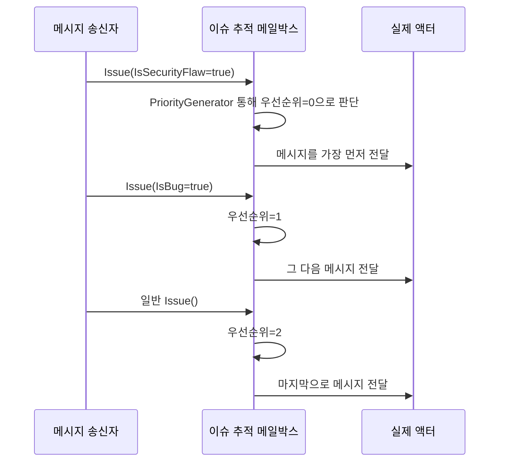

# Chapter 3: 이슈 추적 메일박스(IssueTrackerMailbox)

[이전 장: 기본 액터(BasicActor)](02_기본_액터_basicactor__.md)

## 개요

이전 장에서는 가장 단순한 액터 구조인 “기본 액터(BasicActor)”를 통해 메시지를 어떻게 주고받는지 살펴보았습니다. 이제 메시지를 받을 때 단순히 먼저 온 메시지부터 차례대로 처리하는 것이 아니라, 더 중요한 메시지를 우선 순위 높게 처리하고 싶을 때가 있습니다. 응급실 대기열처럼, 다친 사람(보안 취약점, 버그)이 있으면 빨리 처리해야 하듯이 말이죠.

“이슈 추적 메일박스(IssueTrackerMailbox)”는 액터로 들어오는 메시지 중 “보안 취약점(IsSecurityFlaw)”이나 “버그(IsBug)” 메시지를 먼저 처리하도록 돕는 우선순위 메일박스입니다. 이렇게 중요한 이슈를 빠르게 처리함으로써 시스템이 더 안정적으로 동작하도록 만들 수 있습니다.

---

## 왜 이슈 추적 메일박스가 필요할까요?

상상해보세요: 회사에서 소프트웨어를 운영 중인데, 치명적인 보안 결함을 바로 해결해야 하는 상황이 생겼습니다. 일반 업무 메시지에 밀려 천천히 처리된다면 큰 문제가 생길 수 있습니다. “이슈 추적 메일박스”를 쓰면 이런 치명적 이슈를 가장 먼저 받아서 처리하게 할 수 있습니다.

### 핵심 아이디어
1. 보안 결함(IsSecurityFlaw)이 있으면 다른 메시지보다 최우선으로 처리합니다 (응급실에서 환자 우선).  
2. 버그(IsBug)는 그 다음 순서로 처리합니다.  
3. 일반 이슈(위 두 가지가 아닌)는 가장 마지막에 처리해도 괜찮습니다.

---

## 기본 사용 예시

“이슈 추적 메일박스”를 사용하려면 먼저 메일박스 형식을 HOCON(Human-Optimized Config Object Notation) 설정으로 등록합니다. 예시 코드는 다음과 같습니다.

```csharp
var configStr=@"
akka.actor.mailbox{
  issue-mailbox{
    mailbox-type=""ActorLib.Actor.Test.IssueTrackerMailbox, ActorLib""
  }
}";
var conf=ConfigurationFactory.ParseString(configStr);
var sys=ActorSystem.Create("IssueSystem", conf);
var act=sys.ActorOf(Props.Create<IssueActor>().WithMailbox("issue-mailbox"));
```

1) `issue-mailbox`라는 이름으로 `IssueTrackerMailbox`를 등록합니다.  
2) 등록된 메일박스를 사용할 액터(`IssueActor`)를 생성할 때 `.WithMailbox("issue-mailbox")`를 적용하면 됩니다.  
3) 이렇게 만든 액터에 메시지를 보내면, “이슈 추적 메일박스” 규칙에 따라 문제가 우선 처리됩니다.

---

### 메시지 보내 보기

이제 액터(`act`)에 다양한 메시지를 보내보겠습니다:

```csharp
act.Tell(new Issue { IsSecurityFlaw=true });
act.Tell(new Issue { IsBug=true });
act.Tell(new Issue());
```

위 코드에서  
- 첫 번째 메시지는 “보안 취약점”이므로 `IsSecurityFlaw=true` 입니다.  
- 두 번째 메시지는 “버그”  
- 세 번째 메시지는 보안 결함도 버그도 아닌 일반 이슈입니다.

“이슈 추적 메일박스”가 우선순위를 매겨 처리하므로, 실제로는 첫 번째 메시지(보안 취약점)가 가장 먼저 처리되고, 이후 버그, 마지막에 일반 이슈가 처리됩니다.

---

## 내부 구현 살펴보기

“이슈 추적 메일박스”는 Akka.NET에서 제공하는 `UnboundedPriorityMailbox`를 상속받아 만듭니다. 메시지를 받을 때마다 `PriorityGenerator` 메서드가 우선순위를 결정합니다. 가장 중요한 메시지는 작은 숫자를 (보통 0), 덜 중요한 메시지는 큰 숫자를 반환하도록 하면 됩니다.

아래 코드는 실질적인 메일박스 핵심 부분입니다:

```csharp
public class IssueTrackerMailbox: UnboundedPriorityMailbox {
  public IssueTrackerMailbox(Settings s, Config c): base(s,c){}
  protected override int PriorityGenerator(object m){
    var i=m as Issue; if(i!=null){
      if(i.IsSecurityFlaw)return 0;
      if(i.IsBug)return 1;
    }return 2;
  }
}
```

1) `IssueTrackerMailbox`는 `UnboundedPriorityMailbox`를 상속받습니다.  
2) `PriorityGenerator`에서 메시지가 `Issue` 타입인지 확인합니다.  
3) 만약 `IsSecurityFlaw=true`이면 우선순위를 가장 높게(0) 설정합니다.  
4) 그 다음 `IsBug=true`이면 우선순위 1을 부여합니다.  
5) 둘 다 아니면 2로 처리합니다.

---

### 내부 동작 흐름 (시퀀스 다이어그램)

다음은 간단히 메일박스 내부에서 메시지가 처리되는 흐름의 예시입니다:



1. 송신자가 메일박스(M)로 메시지를 보냅니다.  
2. 메일박스는 `PriorityGenerator`를 통해 우선순위를 평가합니다.  
3. 우선순위가 높은 메시지부터 차례대로 실제 액터(A)에게 전달됩니다.  

---

## 코드상에서 주의할 점

- 메일박스 설정을 등록할 때 이름(`"issue-mailbox"`)이 맞지 않으면, 적용이 안 될 수 있습니다.  
- “IssueTrackerMailbox”에 정의된 우선순위 규칙을 충분히 잘 이해하고, 메시지 타입에 따라 로직을 수정할 수도 있습니다. 예: 더 긴급한 메시지 종류가 생기면 `PriorityGenerator`를 확장해서 0보다 더 빠른 우선순위를 부여할 수도 있습니다.

---

## 마무리 및 다음 단계

이렇게 “이슈 추적 메일박스”를 사용하면 치명적 이슈(보안 또는 버그)를 빠르게 처리하여 시스템 안정성을 높일 수 있습니다.  
- 보안 결함이 있으면 최우선 처리  
- 버그는 그 다음  
- 일반 이슈는 마지막  

이런 메커니즘을 통해, 단순히 메시지가 들어온 순서가 아니라 중요도에 따라 처리 순서를 바꿀 수 있습니다.

다음 장에서는 [FSM 배치 액터(FSMBatchActor)](04_fsm_배치_액터_fsmbatchactor__.md)로 넘어갑니다. FSM(Finite State Machine)을 활용하여 대량 처리를 관리하는 액터 구조를 살펴볼 테니, “메일박스”와는 또 다른 흥미로운 개념을 확인해보세요!  

---

Generated by [AI Codebase Knowledge Builder](https://github.com/The-Pocket/Tutorial-Codebase-Knowledge)