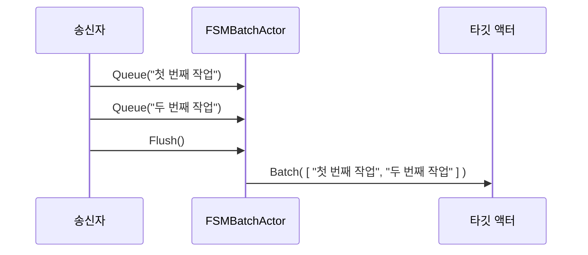

# Chapter 4: FSM 배치 액터(FSMBatchActor)

[이전 장: 이슈 추적 메일박스(IssueTrackerMailbox)](03_이슈_추적_메일박스_issuetrackermailbox__.md)

## 개요

이전 장에서 우리는 메시지의 중요도에 따라 우선순위를 부여하는 메일박스를 배웠습니다. 이번에는 메시지를 한꺼번에 모아서 처리(배치)하는 방법을 살펴보겠습니다. “FSM 배치 액터(FSMBatchActor)”는 유한 상태 기계(Finite State Machine, 이하 FSM) 구조를 사용해, 일정 시간이 지나거나 특정 이벤트가 발생했을 때 메시지를 묶어 처리하는 액터입니다. 

예를 들어, 문서 처리 업무를 하루 종일 모아두었다가 특정 시간에 한꺼번에 결재 라인에 넘기는 상황을 떠올려보세요. 자잘한 작업 요청이 분 단위로 들어올 때마다 즉시 처리하지 않고, 어느 정도 모아서 한 번에 내보내면 리소스를 더 효율적으로 활용할 수 있습니다.

---

## 핵심 아이디어

1. 메시지를 받을 때마다 내부 큐(Queue)에 저장합니다.  
2. “Idle” 상태와 “Active” 상태 사이를 전환하면서 시간이나 명령에 따라 메시지를 묶어서 전송합니다.  
3. “Idle” 상태에서는 대기하고, “Active” 상태가 되면 메시지를 받아들이다가, 타이머가 만료되거나 `Flush` 신호가 오면 한꺼번에 처리합니다.  

이로써 일정 주기로 메시지를 배치하여 처리할 수 있습니다.

---

## 사용 시나리오 예시

- 로그 액터나 분석 액터에 대량의 로그가 들어온다고 가정해봅시다. 건건이 전송하지 않고, 1초 또는 2초간 받은 로그를 한 번에 전송하면, 네트워크 사용을 줄이고 효율을 높일 수 있습니다.  
- 별도의 데이터베이스 저장 작업도 모아서 배치 처리하면, DB 연결을 너무 자주 열고 닫는 문제를 완화할 수 있습니다.

---

## 간단한 사용 방법

우선 “FSMBatchActor”를 생성하고, 메시지들을 큐에 넣은 뒤, 필요하면 한꺼번에 처리할 타깃 액터를 정해줘야 합니다. 예시 코드를 간단히 살펴보겠습니다:

```csharp
// 1) 액터 시스템 생성
var system = ActorSystem.Create("BatchSystem");

// 2) FSMBatchActor 생성
var fsmBatchActor = system.ActorOf(Props.Create<FSMBatchActor>(), "batchActor");

// 3) 배치 결과를 받을 타깃 액터 설정(SetTarget)
fsmBatchActor.Tell(new SetTarget(someTargetActor));
```

1) “BatchSystem”이라는 이름의 액터 시스템을 만듭니다.  
2) “FSMBatchActor”를 “batchActor”라는 이름으로 생성합니다.  
3) “SetTarget” 메시지를 보내서, 배치된 결과를 전달할 액터(someTargetActor)를 지정합니다.

---

### 메시지 배치 넣기 & Flush

```csharp
// 큐에 쌓을 메시지 전송
fsmBatchActor.Tell(new Queue("첫 번째 작업"));
fsmBatchActor.Tell(new Queue("두 번째 작업"));

// 배치를 즉시 날리고 싶다면
fsmBatchActor.Tell(new Flush());
```

- `Queue`를 통해 들어오는 메시지는 전부 내부 큐에 쌓입니다.  
- `Flush` 메시지가 들어오면 누적된 모든 메시지를 한 번에 묶어 `Batch` 형태로 타깃 액터에 전달합니다.  
- 별도의 명령 없이도 일정 시간이 흐르면 자동으로 `Active` 상태에서 `Idle` 상태로 전환하며, 그 시점에 배치가 전송됩니다.

---

## 동작 흐름 미리 살펴보기

다음은 “FSMBatchActor”가 메시지를 받았을 때의 단순 시퀀스 예시입니다:



1. 사용자(S)가 “Queue” 메시지로 작업을 넘겨주면, FSMBatchActor(F)는 내부 리스트에 저장합니다.  
2. `Flush`가 도착하면, 지금까지 쌓인 메시지들을 하나의 `Batch`로 묶어 타깃 액터(T)에 전달합니다.  

---

## 내부 구현 살펴보기

“FSMBatchActor”는 Akka.NET에서 제공하는 `FSM<State, IData>` 클래스를 상속받아 구현됩니다. 여기에는 상태를 나타내는 `State`, 그리고 상태별 데이터(`IData`)가 들어갑니다. 주요 상태로는 “Idle”과 “Active”가 있습니다.

아래 코드를 여러 부분으로 나누어 살펴봅시다.

### 1) 초기 상태 설정

```csharp
public FSMBatchActor()
{
    // 처음에는 Idle 상태에서 시작, 데이터는 Uninitialized
    StartWith(State.Idle, Uninitialized.Instance);
    
    // ...
}
```

- `StartWith(State.Idle, Uninitialized.Instance)`로 Idle 상태와 초기 데이터(Uninitialized)를 정의합니다.

### 2) Idle 상태 로직

```csharp
When(State.Idle, state =>
{
    if (state.FsmEvent is SetTarget target && state.StateData is Uninitialized)
    {
        // 타깃 액터 정보만 저장하고 상태는 그대로 유지
        return Stay().Using(new Todo(target.Ref, ImmutableList<object>.Empty));
    }
    return null;
});
```

- “Idle” 상태에서는 `SetTarget` 메시지를 받으면 `target.Ref`를 기억해두고, 메시지 큐는 비어 있는 상태(Empty)로 시작합니다.  
- 메시지가 Arrive해도 아직은 배치가 시작되지 않은 상태이므로, 특별한 `Queue` 처리가 없고 상태는 유지됩니다.

### 3) Active 상태 로직

```csharp
When(State.Active, state =>
{
    if (state.FsmEvent is Flush or StateTimeout &&
        state.StateData is Todo t)
    {
        // Flush 또는 타임아웃이 발생하면 Idle로 돌아가면서 데이터 초기화
        return GoTo(State.Idle).Using(t.Copy(ImmutableList<object>.Empty));
    }
    return null;
}, TimeSpan.FromSeconds(1));
```

- “Active” 상태에서는 매 1초(`TimeSpan.FromSeconds(1)`)가 지나거나, 누군가 `Flush` 명령을 보내면 `Idle` 상태로 전환(GoTo)하면서, 내부 큐를 비웁니다.  
- 이렇게 상태가 바뀌는 시점에(Active -> Idle) 실제로 메시지를 묶어서 타깃에 보냅니다(아래 “상태 전이 후처리”에서 확인).

### 4) Unhandled 처리 (Idle 또는 Active에서 공통)

```csharp
WhenUnhandled(state =>
{
    if (state.FsmEvent is Queue q && state.StateData is Todo t)
    {
        // 새로운 메시지가 들어오면 큐에 추가하고 Active로 전환
        return GoTo(State.Active).Using(t.Copy(t.Queue.Add(q.Obj)));
    }
    // 그 외 메시지는 무시
    return Stay();
});
```

- “Queue” 메시지가 오면, 아직 Idle이었다 해도 Active 상태로 바꿔서 메시지를 누적하기 시작합니다.  
- Idle 상태에서도 새 메시지가 오면 Active로 바뀌기 때문에, 메시지를 계속 모으기 시작하죠.

### 5) 상태 전이 후처리

```csharp
OnTransition((prev, next) =>
{
    if (prev == State.Active && next == State.Idle)
    {
        if (StateData is Todo todo)
        {
            // 여기서 배치를 타깃 액터에 전달
            todo.Target.Tell(new Batch(todo.Queue));
        }
    }
});
```

- “Active” 상태가 끝나 “Idle” 상태로 전환되는 순간, 쌓여있던 메시지(`todo.Queue`)를 `Batch`로 만들어 타깃 액터에게 보냅니다.  
- 이후 큐는 비어지고, 다시 Idle 상태가 됩니다.

---

## 전체 흐름 한눈에 보기

1. 처음에는 “Idle” 상태이며, 아직 큐가 비어 있고 타깃 액터 정보도 없습니다.  
2. `SetTarget` 메시지를 받으면, 타깃 액터를 저장합니다.  
3. `Queue` 메시지를 받으면 “Active” 상태로 전환하여 큐에 메시지를 쌓습니다.  
4. 더 이상 쌓을 메시지가 없거나, 타이머(1초)가 만료되거나, `Flush`가 오면 다시 “Idle”로 돌아가면서 쌓아둔 메시지를 한 번에 전송(Batch)합니다.

---

## 간단 정리와 다음 장 안내

“FSM 배치 액터(FSMBatchActor)”는 작은 메시지를 여러 개 모았다가 한꺼번에 전송하는 구조를 제공합니다. 이를 통해 다음과 같은 이점을 얻을 수 있습니다:

- 메시지 전송 빈도를 줄여 리소스 사용량 절감  
- 대량 처리를 더 체계적으로 관리  
- 일정 시간이나 조건이 충족될 때만 메시지를 묶어서 전달  

이제 배치 처리의 개념을 이해했다면, 다음 장에서는 [쓰로틀 액터(ThrottleActor)](05_쓰로틀_액터_throttleactor__.md)를 통해 메시지나 트래픽을 천천히, 일정 속도에 맞춰 흘려보내는 기법을 배워보겠습니다. 메시지 폭주 상황에서 시스템이 과부하되지 않도록 제어하는 방법을 함께 살펴보도록 합시다.  

---

Generated by [AI Codebase Knowledge Builder](https://github.com/The-Pocket/Tutorial-Codebase-Knowledge)