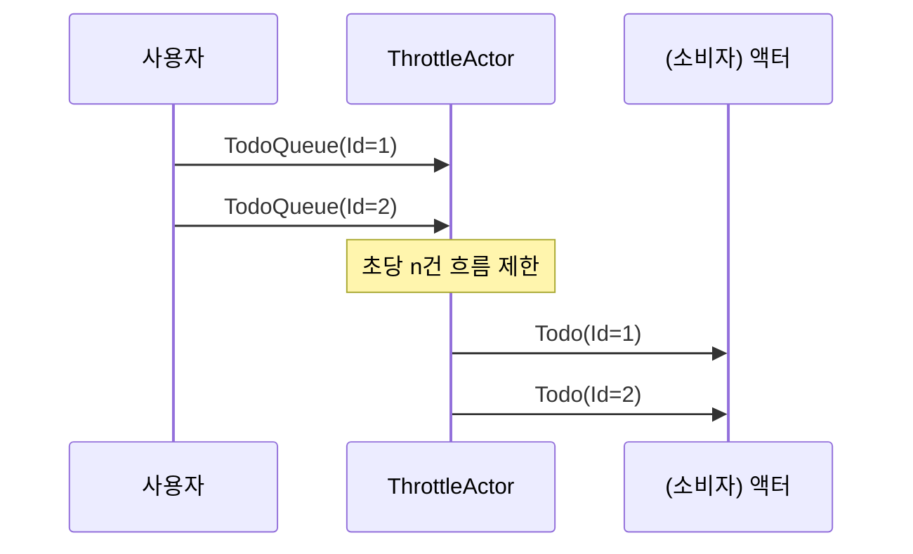
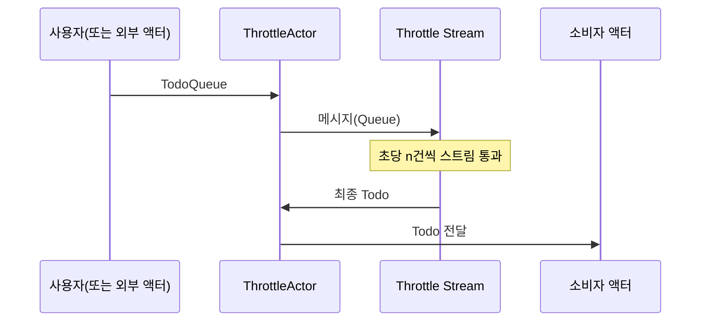

# Chapter 5: 쓰로틀 액터(ThrottleActor)

[이전 장: FSM 배치 액터(FSMBatchActor)](04_fsm_배치_액터_fsmbatchactor__.md)

## 개요와 동기

이전 장에서는 FSM(Finite State Machine)을 활용해 여러 메시지를 모아 한꺼번에 처리하는 “FSM 배치 액터(FSMBatchActor)”를 살펴보았습니다. 이번에는 메시지나 요청이 너무 빠르게 몰려 들어올 때, 순간적으로 서비스가 과부하되지 않도록 일정 속도로만 메시지를 흘려보내는 “쓰로틀 액터(ThrottleActor)”를 알아보겠습니다.

예를 들어, 카메라 시스템에서 촬영 요청이 초당 수백 건씩 들어오면 카메라 디바이스가 감당하기 어려울 수 있습니다. 이때, 쓰로틀 액터가 한 문지기처럼 초당 10건, 20건 등으로 제한을 두어 적당한 속도로 메시지를 처리하도록 조절해줍니다.  

---

## 주요 개념

1. 흐름 제한(Throttle): 액터가 초당 처리할 수 있는 메시지 수(TPS, 초당 처리 건수)를 설정합니다.  
2. 유연한 TPS 변경: 운영 중에 TPS(초당 메시지 처리량)를 바꿀 수 있어, 상황에 따라 빠르게 혹은 느리게 조정할 수 있습니다.  
3. 메시지 흐름 제어: 설정한 개수 이상으로 메시지가 들어오면 대기열에서 기다리거나, 일부를 드롭(drop)하여 과부하 상황을 막을 수 있습니다.  

아키텍처적으로는 ‘Akka.Streams’의 Throttle 기능을 활용해, 액터에 전달되는 메시지를 정해진 속도로만 흘려보냅니다.

---

## 쓰로틀 액터 간단 사용 예시

아래 코드는 “ThrottleActor”를 생성하고, 초당 10건의 메시지만 처리하기로 제한하는 예시입니다.

```csharp
// 1) 액터 시스템 생성
var system = ActorSystem.Create("ThrottleSystem");

// 2) 초당 10건 처리가 가능한 쓰로틀 액터 생성
var throttleActor = system.ActorOf(
    Props.Create(() => new ThrottleActor(10)),
    "throttler"
);
```
위와 같이 “ThrottleSystem”이라는 액터 시스템을 만든 뒤, ‘10’을 넣어두면 “ThrottleActor”는 1초에 최대 10건까지만 메시지를 소비하도록 동작합니다.

---

### 메시지 보내기

아래처럼 “TodoQueue” 메시지를 쓰로틀 액터에게 연속으로 보내보겠습니다.

```csharp
throttleActor.Tell(new TodoQueue {
    Todo = new Todo { Id = "1", Title = "첫 번째 작업" }
});
throttleActor.Tell(new TodoQueue {
    Todo = new Todo { Id = "2", Title = "두 번째 작업" }
});
```

- `TodoQueue` 안에는 실제 처리할 정보(`Todo`)가 들어있습니다.  
- 쓰로틀 액터는 곧바로 모든 메시지를 처리하지 않고, 내부에서 초당 10건 제한에 맞추어 처리 요청을 순차적으로 소화합니다.

---

## 동작 흐름 간단 살펴보기

쓰로틀 액터가 메시지를 받았을 때, 어떤 식으로 메시지를 제한하는지 간단한 시퀀스 다이어그램으로 나타내면 다음과 같습니다:



1. 사용자가 쓰로틀 액터(T)에 여러 ‘TodoQueue’ 메시지를 빠르게 전송합니다.  
2. 쓰로틀 액터는 내부적으로 “초당 n건” 속도를 지키며 실제 소비자(C)에 ‘Todo’ 메시지를 하나씩 전달합니다.  
3. TPS가 초과되면 일정 건수만큼 대기하거나, 설정에 따라 메시지를 드롭할 수도 있습니다.

---

## 내부 구현 살펴보기

“ThrottleActor”는 ‘Akka.Streams’를 사용해 메시지 흐름을 제어합니다. 크게 보면 다음 과정을 거칩니다:

1. “ActorRef Source” 생성: 메시지를 받을 수 있는 스트림 소스(Source)처럼 동작합니다.  
2. “Throttle(...)”로 초당 처리량을 제한: 정해둔 TPS(예: 10, 20 등)만큼만 메시지를 통과시킵니다.  
3. “Sink.ActorRef”로 최종 메시지는 다시 액터 본인(Self)에 전달하고, 이때 실제 처리를 진행합니다.

아래처럼 짧게 분할된 코드 조각을 살펴봅시다. (핵심 부분만 예시로 발췌)

```csharp
// 생성자 부분 일부
_throttler =
    Source.ActorRef<object>(1000, OverflowStrategy.DropNew)
          .Throttle(_processCouuntPerSec, TimeSpan.FromSeconds(1))
          .To(Sink.ActorRef<object>(Self, NotUsed.Instance))
          .Run(_materializer);
```
1) `Source.ActorRef<object>`: 액터를 스트림 형태로 바라보기 위한 소스입니다.  
2) `.Throttle(...)`: 여기서 `_processCouuntPerSec`만큼 초당 흐름 제한을 설정합니다.  
3) `.To(Sink.ActorRef<object>(Self, NotUsed.Instance))`: 제한을 통과한 메시지를 다시 이 액터(Self)로 보내어 최종 로직을 수행합니다.

이렇게 쓰로틀 스트림을 만들면, 액터는 메시지를 `_throttler`에게 전달하고, `_throttler`는 속도 제한에 맞춰 메시지를 흘려준 뒤, 최종적으로 다시 액터에게 메시지를 보냅니다.

---

### TPS 동적 변경

운영 중에 TPS(초당 처리 건수)를 바꿔야 할 때는 “ChangeTPS” 메시지를 쓰로틀 액터에 보내면 됩니다. 코드 예시는 다음과 같이 단순하게 표현할 수 있습니다:

```csharp
throttleActor.Tell(new ChangeTPS { processCouuntPerSec = 20 });
```

- 현재 TPS가 10이었다면, 이 메시지를 받은 뒤에는 초당 20건으로 제한을 바꿉니다.  
- 내부적으로 쓰로틀 스트림을 재생성해 새로운 초당 처리량을 적용합니다.  

---

## 실제 처리 로직 이해하기

쓰로틀 액터는 메시지를 최종적으로 “Todo” 형태로 받아서 로그를 남기거나, 지정된 소비자 액터에 전달합니다. 예를 들어, 소비자 액터를 설정하고 싶다면 아래처럼 “SetTarget” 메시지를 보냅니다:

```csharp
throttleActor.Tell(new SetTarget(consumerActorRef));
```

이후, 메시지가 쓰로틀 과정을 거쳐 최종적으로 도착했을 때, 쓰로틀 액터가 내부에서 다음과 같은 일을 합니다:
1. 로그 출력(필요 시)  
2. consumerActorRef에 메시지 전달  

---

## 내부 메시지 처리 순서 (요약)

아래는 “ThrottleActor” 내부에서 메시지가 처리되는 흐름을 단순화한 시퀀스 다이어그램입니다:



1. 사용자(U)가 쓰로틀 액터(TH)에 ‘TodoQueue’ 메시지를 보냅니다.  
2. 쓰로틀 액터는 `_throttler`(STR)에 메시지를 넘깁니다.  
3. 제한된 속도에 맞춰 최종 ‘Todo’가 다시 쓰로틀 액터(TH)로 흘러들어옵니다.  
4. 쓰로틀 액터는 설정된 소비자(C)에게 메시지를 전달해 처리합니다.

---

## 간단 정리

- 쓰로틀 액터(ThrottleActor)는 초당 처리량(TPS)을 제한하여, 많은 메시지가 몰릴 때 시스템이 과부하되지 않도록 조절해줍니다.  
- ‘Akka.Streams’를 활용하며, TPS 변경도 동적으로 가능해 운영 유연성이 좋습니다.  
- ‘SetTarget’으로 최종 메시지를 받을 액터를 지정하고, ‘TodoQueue’ 메시지를 통해 실제 작업을 요청할 수 있습니다.  

이제 메시지를 제한된 속도로 흘려보내는 방법도 익혔으니, 다음 장에서는 [SSE 사용자 액터(SSEUserActor)](06_sse_사용자_액터_sseuseractor__.md)를 통해 서버-센트-이벤트(Server-Sent Events) 방식으로 사용자와 데이터를 주고받는 기법을 배워보겠습니다.  

그렇게 하나씩 이해해 가다 보면, 다양한 상황에서 Akka.NET 액터를 어떻게 조합하면 좋을지 감이 잡히실 것입니다.  


---

Generated by [AI Codebase Knowledge Builder](https://github.com/The-Pocket/Tutorial-Codebase-Knowledge)