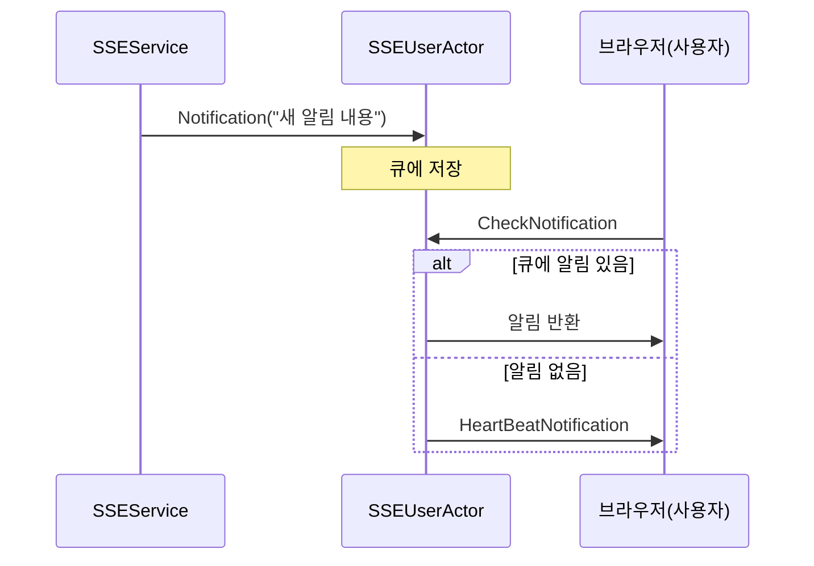

# Chapter 6: SSE 사용자 액터(SSEUserActor)

[이전 장: 쓰로틀 액터(ThrottleActor)](05_쓰로틀_액터_throttleactor__.md)

서버에서 클라이언트로 계속해서 정보를 보내야 하는 상황, 예컨대 라디오 방송국이 청취자에게 새로운 소식을 실시간으로 전달하는 모습을 상상해봅시다. “SSE 사용자 액터(SSEUserActor)”는 바로 이런 **Server-Sent Events(SSE)** 기반 통신을 편리하게 구현하기 위한 액터입니다. 쉽게 말해, 서버가 사용자(클라이언트)에게 일방적으로 **알림**을 ‘푸시(push)’하는 구조를 지원해줍니다.

---

## 왜 SSEUserActor가 필요할까요?

- 웹 클라이언트가 실시간 알림을 받고 싶을 때, 웹소켓 대신 SSE(Server-Sent Events)를 사용할 수 있습니다.  
- 기존의 폴링(polling) 기법처럼 일정 간격으로 계속 요청을 보내지 않아도, **서버 쪽에서 필요할 때** 바로 알림을 내려줄 수 있습니다.  
- SSEUserActor는 ‘사용자별로 쌓인 알림’을 관리해두고, 사용자가 알림 확인(체크)을 요청하면 즉시 알림을 반환해줍니다. 알림이 없다면 연결만 유지하기 위한 간단한 ‘Heartbeat(하트비트)’ 메시지를 주어 끊김이 없도록 돕습니다.

---

## 핵심 아이디어 한눈에 보기

1. 각 사용자를 위한 큐(Queue)를 관리  
2. 외부에서 “Notification” 같은 새 알림이 오면 큐에 저장  
3. 사용자가 “CheckNotification” 메시지를 보내면 큐에 있는 알림을 꺼내 전송  
4. 알림이 없으면 “Heartbeat” 메시지로 연결 상태만 유지  

이렇게 필요할 때만 **두둑**하고 알림을 끊어 보내므로, 서버와 클라이언트 사이의 부하를 줄이면서도 실시간 알림 분위기를 낼 수 있습니다.

---

## 간단 사용 시나리오

사용자가 웹 브라우저에서 알림을 받고 싶다고 가정해봅시다. 우선 서버 쪽에는 “SSEService”가 있고, 이 서비스는 내부적으로 “SSEUserActor”를 사용합니다. 아래 흐름을 살펴볼까요?

1. 어떤 사용자가 본인 고유의 아이디(예: "user123")로 서버에 접속  
2. “SSEService”가 “SSEUserActor”를 찾아서(또는 없으면 새로 만들고) 알림을 큐에 적재  
3. 클라이언트가 알림 체크를 요청하면(“CheckNotification”), 큐에 있던 알림을 받아서 즉시 표시  
4. 알림이 없다면, 연결 유지를 위한 “Heartbeat” 전송  

---

## 기본 코드 예시

아래는 “SSEUserActor”가 알림(Notification)을 큐에 쌓고, CheckNotification 메시지를 받으면 꺼내주는 모습입니다. (워킹 로직의 핵심 부분만 발췌)

```csharp
public class SSEUserActor : ReceiveActor
{
    private Queue<Notification> notifications = new Queue<Notification>();

    public SSEUserActor(string identyValue)
    {
        // 새 사용자를 위한 환영 메시지 미리 등록
        notifications.Enqueue(new Notification { Message = $"[{identyValue}] 웰컴메시지" });

        // 새 알림(Notification) 수신 시 큐에 추가
        Receive<Notification>(msg => { notifications.Enqueue(msg); });

        // 알림 체크 요청 시
        Receive<CheckNotification>(msg =>
        {
            if (notifications.Count > 0)
            {
                Sender.Tell(notifications.Dequeue());
            }
            else
            {
                // 알림이 없다면 심박(Heartbeat) 유지
                Sender.Tell(new HeartBeatNotification());
            }
        });
    }
}
```

1) “notifications”라는 큐를 사용해 새 알림을 저장합니다.  
2) `Receive<Notification>`을 통해 알림이 들어오면 바로 큐에 쌓습니다.  
3) `Receive<CheckNotification>`을 처리할 때, 큐가 비어 있지 않다면 맨 앞의 알림을 꺼내서 보내고, 비어 있으면 “HeartBeatNotification”을 반환합니다.

---

### 코드 작동 방식 이해하기

아주 간단하게 시퀀스 다이어그램으로 정리해봅시다.



1. SSEService(혹은 다른 주체)가 U(SSEUserActor)에게 새 알림을 보냅니다. U는 이를 큐에 쌓습니다.  
2. 브라우저(B) 사용자가 “CheckNotification” 요청을 보내면, U가 큐에서 알림을 하나 뽑아서 돌려줍니다.  
3. 큐가 비어 있으면 “HeartBeat” 메시지를 주어 “연결만 살아 있다”는 신호를 보냅니다.

---

## SSEService와의 연동 예시

“BlazorActorApp” 같은 프로젝트에서 “SSEService”가 “SSEUserActor”를 찾아서 알림을 넣거나 체크 요청을 처리할 수 있습니다. 아래는 아주 축약한 사용 예시입니다:

```csharp
// SSEService 내부의 일부
public async Task<object> CheckNotification(string userKey)
{
    var myActor = await findUserByIdenty(userKey);
    return await myActor.Ask(new CheckNotification(), TimeSpan.FromSeconds(3));
}
```

1) “findUserByIdenty” 메서드로 사용자의 SSEUserActor를 가져옵니다(없으면 새로 생성).  
2) “Ask”를 통해 “CheckNotification” 메시지를 보내고 결과를 기다립니다.  
3) 몇 초 내로 응답이 오면 알림이거나, 없으면 하트비트를 받게 됩니다.

---

## 내부 구현 더 살펴보기

“SSEUserActor”는 내부적으로 간단한 큐를 이용하는 구조이지만, 다음과 같은 점을 주의해야 합니다:

1. 큐 크기가 너무 커지지 않도록 관리하거나, 오래된 알림을 정리하는 정책이 필요할 수 있습니다.  
2. 알림을 처리한 후 바로 삭제(Dequeue)해야 메모리가 늘어나지 않습니다.  
3. 하트비트를 적절히 전달해야 클라이언트와 연결이 시간 초과로 끊기지 않습니다.

아래 추가 코드는 “CheckNotification” 처리 중, 알림이 없을 때 하트비트를 일정 지연 후에 다시 보내는 로직 예시(축소본)입니다:

```csharp
ReceiveAsync<CheckNotification>(async msg =>
{
    if (notifications.Count > 0)
    {
        Sender.Tell(notifications.Dequeue());
    }
    else
    {
        await Task.Delay(1000);
        Sender.Tell(new HeartBeatNotification());
    }
});
```

- 알림이 없을 경우 잠깐(1초 정도) 대기한 뒤 하트비트를 보냅니다.  
- 실제 구현에서는 “PipeTo”나 콜백 형태로 처리를 할 수도 있고, 로거(로그)나 모니터링을 붙일 수도 있습니다.

---

## 간단 정리 및 마무리

“SSE 사용자 액터(SSEUserActor)”는 다음과 같은 이점을 제공합니다:  
1. 사용자별로 큐를 두어 새 알림을 편하게 수신  
2. 클라이언트가 알림을 요청할 때 즉시 반환하거나, 없으면 하트비트로 연결 유지  
3. SSE 방식을 통해 실시간 알림을 구현할 때 부담을 덜어줌  

이제 SSE를 이용해 서버에서 이벤트를 자유롭게 밀어줄 수 있게 되었습니다. 다음 장에서는 [세일즈 액터(SalesActor)](07_세일즈_액터_salesactor__.md)를 확인하며, 판매와 관련된 메시지 흐름을 어떻게 액터로 처리할 수 있는지 살펴보겠습니다.  

서버와 클라이언트가 계속 연결되어 있게 만드는 방법을 알았으니, 비즈니스 로직 측면에서도 더욱 자유롭고 실시간에 가까운 구현이 가능해집니다. 다음 장에서 다시 만나 봅시다!

---

Generated by [AI Codebase Knowledge Builder](https://github.com/The-Pocket/Tutorial-Codebase-Knowledge)