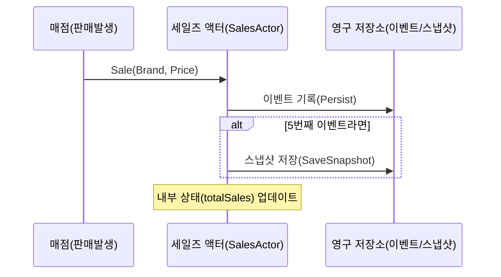
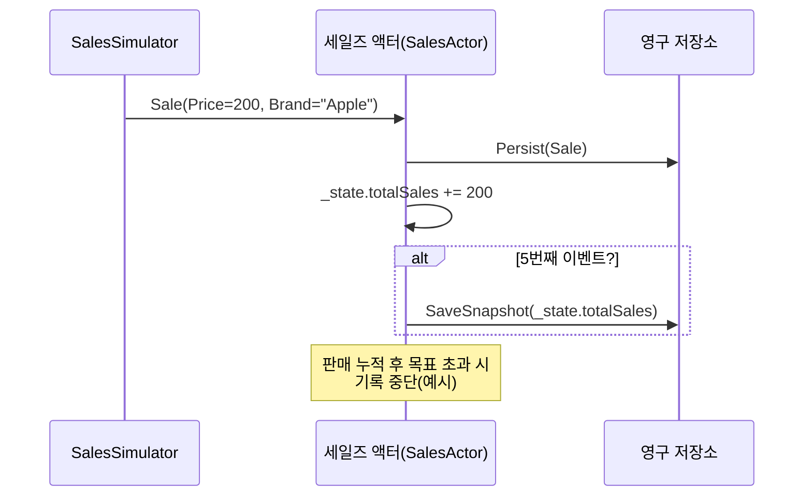

# Chapter 7: 세일즈 액터(SalesActor)

[이전 장: SSE 사용자 액터(SSEUserActor)](06_sse_사용자_액터_sseuseractor__.md)

세일즈 액터(SalesActor)는 “매점에서 상품을 판매할 때마다 매출 기록을 남기고, 일정 횟수마다 전체 매출 누적 상태를 스냅샷으로 저장”하는 액터입니다. 장애나 재부팅이 생겨도 이전 데이터(이벤트, 스냅샷)를 복구함으로써 매출 손실 없이 안전하게 관리할 수 있게 해줍니다.

예를 들어, “500만 원”이라는 목표 매출에 도달할 때까지 매번 판매가 일어날 때마다 영구 기록하고, 5번에 한 번씩 전체 합을 ‘사진 찍듯’ 저장합니다. 만약 시스템이 중간에 다운되어도, 이벤트와 스냅샷을 통해 재시작 시 정확한 매출 합계로 복원되므로 회계나 재고 관리를 안정적으로 진행할 수 있습니다.

---

## 왜 세일즈 액터가 필요한가요?

- 판매 이벤트가 연속으로 발생해도, 각각 안정적으로 영구 저장하고 싶을 때 사용합니다.  
- “언제든지” 누적 매출 상태를 다시 불러와야 하는 경우가 많습니다(감사, 보고 등).  
- Akka.Persistence를 활용해 이벤트 기반으로 기록하고, 일정 횟수마다 스냅샷으로 빠른 복원을 지원해줍니다.

---

## 전체 구조 한눈에 보기

1. 판매 정보(Sale) 메시지를 받으면 영구(Event)로 기록합니다.  
2. 내장된 상태(SalesActorState)에 총 매출액을 누적합니다.  
3. 누적된 이벤트가 5개가 될 때마다 스냅샷으로 전체 매출액을 저장합니다.  
4. 액터가 재시작 또는 장애 복구 시, 스냅샷 → 이벤트 순으로 복구해 정확한 합계를 재계산합니다.

아래는 간단한 시퀀스 예시입니다:



---

## 사용 예시: 판매 시뮬레이터와 연동

보통은 별도의 “판매 시뮬레이터(SalesSimulatorActor)”나 실제 결제 흐름에서 세일즈 액터에게 `Sale` 메시지를 보냅니다. 아래는 간단한 예시 코드 조각입니다(설명용으로 축약):

```csharp
// 판매 시뮬레이터 액터가 주기적으로 Sale 메시지를 생성
public class SalesSimulatorActor : ReceiveActor
{
    private readonly IActorRef _salesActor;

    public SalesSimulatorActor(IActorRef salesActor)
    {
        _salesActor = salesActor;
        Context.System.Scheduler.ScheduleTellRepeatedly(
            TimeSpan.Zero,
            TimeSpan.FromSeconds(2),
            Self,
            new StartSimulate(),
            Self
        );

        Receive<StartSimulate>(_ =>
        {
            var sale = new Sale(200, "Apple");
            _salesActor.Tell(sale);
        });
    }
}
```

1. `ScheduleTellRepeatedly` 메서드로 2초마다 `StartSimulate` 메시지를 보내도록 예약합니다.  
2. 실제 `StartSimulate`를 받으면, 예시로 200원짜리 "Apple" 판매를 생성해 `_salesActor`(즉, 세일즈 액터)에게 전송합니다.  
3. 이후 세일즈 액터가 이벤트 영구 저장, 스냅샷 생성 등을 처리합니다.

---

## 세일즈 액터 주요 코드 살펴보기

세일즈 액터는 “ReceivePersistentActor”를 상속받아 “영구”로 저장할 이벤트와 스냅샷 복구 로직을 구현합니다. 아래는 핵심 메서드를 10줄 이하씩 나누어 보여드립니다.

### 1) 클래스 선언과 기본 상태

```csharp
public class SalesActor : ReceivePersistentActor
{
    public override string PersistenceId => "sales-actor";
    private SalesActorState _state;

    public SalesActor(long expectedProfit)
    {
        _state = new SalesActorState { totalSales = 0 };
        // ...
    }
    // ...
}
```

- `PersistenceId`는 영구 저장소에서 이 액터를 구분할 유니크한 ID입니다.  
- `_state`는 지금까지 누적 판매금을 기억하는 내부 상태입니다.  
- `expectedProfit`는 예시로 “목표 매출”을 받아서, 초과 시 추가 기록을 중단할 수 있게 하는 용도로 쓸 수 있습니다.

### 2) 이벤트를 영구에 기록(Persist)

```csharp
Command<Sale>(saleInfo =>
{
    Persist(saleInfo, _ =>
    {
        _state.totalSales += saleInfo.Price;
        if (LastSequenceNr % 5 == 0)
            SaveSnapshot(_state.totalSales);
    });
});
```

1. `Command<Sale>`는 `Sale` 메시지가 들어오면 실행될 로직을 의미합니다.  
2. `Persist(...)`를 통해 이벤트를 실제 DB(RavenDB 등)에 기록합니다.  
3. 성공 후에 `_state.totalSales`를 갱신합니다.  
4. 메시지 시퀀스 번호(`LastSequenceNr`)가 5의 배수일 때 스냅샷을 저장(`SaveSnapshot`)합니다.

### 3) 스냅샷 성공 처리

```csharp
Command<SaveSnapshotSuccess>(snapshotMsg =>
{
    Console.WriteLine(
        $"스냅샷 저장 성공. 시퀀스 번호: {snapshotMsg.Metadata.SequenceNr}");
});
```

- 스냅샷이 성공적으로 저장되면 로그를 남겨 상태를 확인해볼 수 있습니다.  
- 필요하면 오래된 이벤트를 삭제(`DeleteMessages`)하여 시스템을 가볍게 만들 수도 있습니다.

### 4) 복구(이벤트, 스냅샷) 처리

```csharp
Recover<Sale>(saleInfo =>
{
    _state.totalSales += saleInfo.Price;
});
Recover<SnapshotOffer>(offer =>
{
    var total = (long)offer.Snapshot;
    _state.totalSales = total;
});
```

- 재시작 시 먼저 스냅샷(`SnapshotOffer`)을 적용해 `_state.totalSales`를 복원합니다.  
- 스냅샷 이후의 이벤트(`Recover<Sale>`)들도 순서대로 적용해 최신 상태를 완성합니다.

---

## 동작 흐름 자세히 보기

세일즈 액터가 판매 이벤트를 받는 과정을 표현하면 다음과 같습니다:



1. 판매 시뮬레이터가 “Sale” 메시지를 보냅니다.  
2. 세일즈 액터가 이벤트를 DB에 기록한 후, 내부 총 매출을 업데이트합니다.  
3. 5번째 마다 스냅샷을 저장해, 다음 복구 시 빠른 로딩을 합니다.

---

## 실제 활용시 주의사항

1. 스냅샷 주기: 너무 자주 하면 저장 부담이 크고, 너무 드물면 복구 시간이 길어집니다. 적절한 타이밍을 조절해야 합니다.  
2. 장애 복구 테스트: 실제 장애 상황에서 이벤트와 스냅샷이 올바르게 재적용되는지 수시로 점검하는 것이 좋습니다.  
3. 영구 저장소 설정: Akka.Persistence는 다양한 백엔드를 지원합니다(RavenDB, SQL, etc). 프로젝트에 맞는 설정이 필요합니다.

---

## 정리 및 다음 장 소개

이 장에서는 세일즈 액터(SalesActor)를 통해 이벤트 소싱(Event Sourcing)과 스냅샷(Snapshot) 기능을 간단히 살펴보았습니다.  
- 이벤트를 영구 저장하고, 필요 시 스냅샷을 찍어두면 빠른 복구가 가능합니다.  
- 장애나 재시작 후에도 안전하게 매출 데이터를 복원할 수 있습니다.  
- Akka.Persistence의 강점을 활용해, 손쉽게 회계·판매 레코드를 안정적으로 관리할 수 있습니다.

다음 장에서는 [여행 리뷰 저장소(TravelReviewRepository)](08_여행_리뷰_저장소_travelreviewrepository__.md)를 알아봅니다. 이제 판매나 매출뿐 아니라, 여행 리뷰 정보도 저장·조회하는 방법을 살펴보며, 또 다른 관점에서 액터 시스템을 확장해 볼 예정입니다.  

---

Generated by [AI Codebase Knowledge Builder](https://github.com/The-Pocket/Tutorial-Codebase-Knowledge)