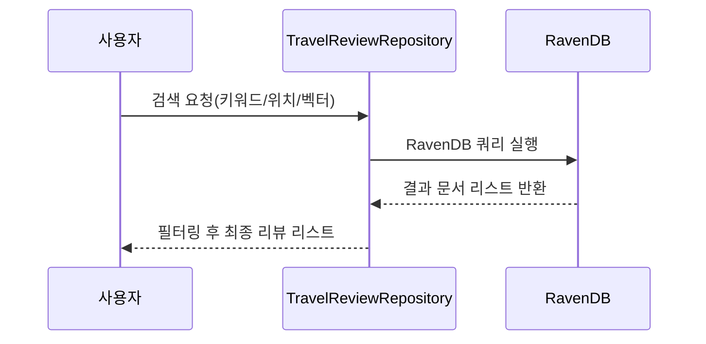

# Chapter 8: 여행 리뷰 저장소(TravelReviewRepository)

[이전 장: 세일즈 액터(SalesActor)](07_세일즈_액터_salesactor__.md)

## 개요
여행을 떠날 때, 사람들은 “진짜 좋았던 곳은 어디인지, 직접 다녀온 사람들의 생생한 후기가 궁금”해집니다. “여행 리뷰 저장소(TravelReviewRepository)”는 바로 이런 사용자 후기를 저장하고, 빠르게 검색할 수 있도록 RavenDB 기반으로 만든 저장소입니다.  
- 예: “따뜻한 해변 휴양지”를 찾을 때, 키워드 검색이나 지도 기반 반경 검색, 심지어 벡터 임베딩(유사도) 검색도 가능  
- RavenDB에 문서를 저장하듯, “TravelReview”라는 객체를 손쉽게 저장·조회  

이 장에서는 간단한 사용 예시와 내부 구현 흐름을 살펴보며, 초보자도 손쉽게 여행 리뷰 관리 기능을 이해할 수 있도록 안내합니다.

---

## 주요 기능 한눈에 보기
1. 텍스트 검색(키워드)  
2. 반경 기반 위치 검색(지도상 주위 몇 Km)  
3. 벡터 임베딩 검색(유사도 높은 리뷰 찾기)  

예컨데 사용자가 “마음이 따뜻해지는 휴양”을 입력하면, 관련 키워드를 포함하거나, 비슷한 태그 벡터를 가진 리뷰를 빠르게 반환할 수 있습니다.

---

## 기본 사용 예시

아래 예시는 “여행 리뷰 저장소”를 사용해 새로운 리뷰를 추가하고, 반경 혹은 텍스트 검색을 간단히 시도하는 모습을 보여줍니다.

```csharp
// 1) RavenDB DocumentStore 생성 (생략)
// 2) TravelReviewRepository 인스턴스 생성
var reviewRepo = new TravelReviewRepository(documentStore);

// 3) 리뷰 추가
reviewRepo.AddReview(new TravelReview {
    Title = "힐링되는 제주도 여행",
    Content = "마음이 따뜻해지는 휴양지였어요",
    Latitude = 33.4996,
    Longitude = 126.5312
});
```
- DocumentStore는 RavenDB 연결 객체라고 생각하시면 됩니다.  
- `AddReview`를 호출하면, 새로운 `TravelReview`가 DB에 저장됩니다.

```csharp
// 텍스트 검색
var textResults = reviewRepo.SearchReviews(
    "따뜻해지는", 
    33.0, 126.0, 
    50, null);
```
- `"따뜻해지는"` 키워드가 포함된 리뷰 중, 대략 “위도 33 / 경도 126”에서 반경 50Km 이내를 필터링하여 조회합니다.  

---

## 위치 기반 검색 살펴보기
RavenDB에서 제공하는 GeoSpatial 기능을 활용하면, 리뷰가 저장된 위치 정보를 사용해 반경 내 여행 리뷰를 찾을 수 있습니다.

```csharp
// 반경 검색 전용
var radiusResults = reviewRepo.SearchReviewsByRadius(
    33.4996, 
    126.5312, 
    10.0);
```
- “위도 33.4996 / 경도 126.5312” 위치에서 10km 이내에 있는 리뷰를 가져옵니다.  
- 제주도 일대에 올린 리뷰만 모아서 보는 식으로 활용할 수 있습니다.

---

## 벡터 임베딩 검색
“벡터 임베딩(Vector Embedding)”을 사용하면 단순 키워드 일치가 아니라, “의미가 유사한” 리뷰를 찾을 수 있습니다. 예를 들어, “힐링”과 “휴양”이 비슷한 맥락이라면, 유사도가 높은 리뷰를 보여줄 수 있습니다.

```csharp
// 임의의 5차원 벡터 예시
float[] userVector = new float[] { 1.0f, 0.2f, 0.9f, 0.3f, 0.0f };
var vectorResults = reviewRepo.SearchReviewsByVector(userVector, 3);
```
- 검색 벡터 `userVector`와 유사도가 높은 리뷰 상위 3개를 반환합니다.  
- 태그나 컨텐츠를 임베딩해둔 뒤, 비슷한 의미를 가진 리뷰를 손쉽게 찾을 수 있습니다.

---

## 내부 동작 흐름 (간단 이해)

다음은 사용자가 리뷰 검색을 요청할 때, 내부에서 일어나는 과정을 간단한 시퀀스 다이어그램으로 표현했습니다.


1. 사용자가 “SearchReviews” 같은 메서드를 통해 검색 요청  
2. 저장소(TravelReviewRepository)가 RavenDB에 적절한 쿼리를 날림  
3. RavenDB가 조건에 맞는 리뷰 목록을 반환  
4. 필요 시 추가 필터링을 한 뒤, 사용자에게 최종 결과 제공  

---

## 코드 구조 살짝 들여다보기

실제 구현은 아래와 같이 세 가지 주요 파일로 나뉩니다.

1. **TravelReviewIndex.cs**: RavenDB 인덱스를 생성해, 텍스트 필드(Content, Category)에 대한 검색을 빠르게 처리  
2. **TravelReviewRepository.cs**: 리뷰 추가, 텍스트/위치/벡터 검색 메서드를 제공  
3. **TravelReview.cs**: 실제 리뷰 데이터 모델(Title, Content, Latitude, Longitude, TagsEmbeddedAsSingle 등)

### TravelReviewIndex (예시)
```csharp
public class TravelReviewIndex : AbstractIndexCreationTask<TravelReview>
{
    public TravelReviewIndex()
    {
        Map = reviews => from r in reviews
                         select new { r.Content, r.Category };

        Indexes.Add(x => x.Content, FieldIndexing.Search);
        Indexes.Add(x => x.Category, FieldIndexing.Search);
    }
}
```
- “`Map`”을 통해 RavenDB가 “Content”와 “Category”를 검색용 인덱스로 만듭니다.  
- 덕분에 “Search(r => r.Content, "키워드")” 시 속도 향상을 기대할 수 있습니다.

### TravelReviewRepository (일부)
```csharp
public List<TravelReview> SearchReviewsByVector(float[] vector, int topN = 5)
{
    using (var session = _store.OpenSession())
    {
        return session.Query<TravelReview>()
            .VectorSearch(
                field => field.WithEmbedding(x => x.TagsEmbeddedAsSingle, VectorEmbeddingType.Single),
                qv => qv.ByEmbedding(new RavenVector<float>(vector)),
                0.85f,
                topN)
            .ToList();
    }
}
```
- “VectorSearch” 구문을 통해 벡터 임베딩 유사도를 확인합니다.  
- “0.85f”는 임계치(threshold) 예시 값으로, 유사도가 그보다 높으면 결과로 간주합니다.

---

## 마무리
“여행 리뷰 저장소(TravelReviewRepository)”는 RavenDB의 강력한 기능을 활용해, 키워드·반경·벡터 검색을 모두 지원합니다. 이를 통해 사용자에게 **맞춤형 여행 후기**를 빠르게 제공할 수 있습니다.  
- **포인트**: 리뷰 문서를 저장하면, 지도나 키워드, 심지어 의미 벡터로도 검색이 자유롭다.  
- **활용**: 개인화 추천, 감성 분석 등과 결합해 더 풍부한 여행 서비스를 구현할 수 있음.  

[다음 장: 기록 액터(RecordActor)](09_기록_액터_recordactor__.md)에서는 또 다른 관점에서 “기록”을 어떻게 액터로 관리할 수 있는지 살펴봅시다.  
녕!  

---

Generated by [AI Codebase Knowledge Builder](https://github.com/The-Pocket/Tutorial-Codebase-Knowledge)