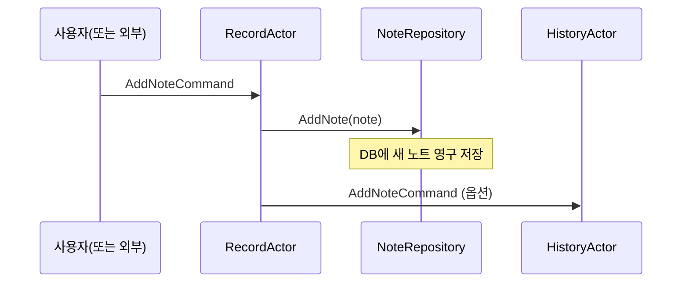

# Chapter 9: 기록 액터(RecordActor)

[이전 장: 여행 리뷰 저장소(TravelReviewRepository)](08_여행_리뷰_저장소_travelreviewrepository__.md)

“기록 액터(RecordActor)”는 MCPServer 환경에서 노트(메모) 정보를 영구 저장하고, 필요한 순간에 히스토리(HistoryActor)로 알림을 보내는 역할을 합니다. 예를 들어, 회사에서 문서를 수집해 문서 보관소(NoteRepository)에 넣고, 담당 부서(HistoryActor)에게 “저장 완료!”라고 알리는 흐름을 떠올리면 이해가 쉽습니다.

이 장에서는 “기록 액터(RecordActor)”가 어떤 문제를 해결하는지, 어떻게 사용하는지, 내부 구조는 어떻게 생겼는지 초보자도 쉽게 따라올 수 있도록 하나씩 살펴보겠습니다.

---

## 왜 기록 액터가 필요할까요?

상상해보세요. 어떤 사용자가 새 노트(메모)를 등록해야 하는 상황입니다. 데이터베이스에 메모 정보를 저장하고, “나중에 다시 찾아볼 수 있도록” 기록한 사실을 특정 담당 액터(HistoryActor)에게도 알려야 합니다.  
- “데이터 저장”과 “알림”을 한 곳에서 처리하면 구조가 복잡해질 수 있습니다.  
- 여러 가지 기능(저장, 알림, 검증 등)이 섞여버리면 유지보수가 어려워집니다.  

반면, “기록 액터”는 이 일을 깔끔히 분리해줍니다.  
1) “AddNoteCommand”가 들어오면 노트를 DB(NoteRepository)에 적재  
2) 히스토리 쪽이 필요하면 “HistoryActor”에 알림 전송  

이를 통해 메시지 기반으로 동작하는 액터들의 느슨한 결합을 유지하면서, 기록과 후속 작업을 명확히 분리할 수 있습니다.

---

## 사용 시나리오

예를 들어, 간단한 웹 API가 있다고 합시다. 사용자가 “새 메모”를 등록하려고 `POST /notes`를 호출합니다.  
1. 이 요청은 “기록 액터”에게 “AddNoteCommand”를 전송합니다.  
2. “기록 액터”는 NoteRepository에 메모를 영구 저장합니다.  
3. 저장이 완료되면, “HistoryActor”에 “방금 노트가 추가되었음”을 알립니다.  
4. (선택) “HistoryActor”는 그 사실을 로깅하거나, 다른 로그 액터로 보내어 이력을 관리합니다.

이렇게 각 액터가 자기 할 일을 확실히 맡아 처리하므로, 시스템 전체가 단순하면서도 확장성 있게 움직입니다.

---

## 기록 액터의 핵심 메시지들

기록 액터는 크게 다음과 같은 메시지를 받습니다:

1. IActorRef  
   - 테스트용 참조나 다른 유틸 액터를 세팅할 때 사용  
2. SetHistoryActorCommand  
   - 기록 액터가 알림을 보낼 히스토리 액터를 지정  
3. AddNoteCommand  
   - 새 노트를 DB에 쓰고, 히스토리 액터에 알림  

이 외에도 테스트나 확장 상황에 따라 다양한 메시지를 받을 수 있지만, 기본 골자는 위와 같습니다.

---

## 코드 예시 살펴보기

아래는 “RecordActor”의 간단한 코드 예시(파일: “RecordActor.cs”)를 여러 조각으로 나누어 소개합니다. 전체 코드는 MCPServer 프로젝트 기반 예시이나, 핵심 로직만 한눈에 이해할 수 있도록 각 부분을 나누었으니 따라와 보세요.

### 1) 기본 클래스 선언 및 필드

```csharp
public class RecordActor : ReceiveActor
{
    private readonly ILoggingAdapter logger = Context.GetLogger();
    private IActorRef? testProbe;
    private IActorRef? historyActor;

    private readonly NoteRepository noteRepository;
    
    public RecordActor()
    {
        noteRepository = new NoteRepository();
        // ...
    }
}
```

- “ReceiveActor”를 상속받아 메시지 기반 메서드를 등록합니다.  
- “logger”는 로그를 남기기 위한 Akka.NET 로깅 어댑터(필수 아님).  
- “testProbe”는 테스트 코드에서만 쓰일 수 있는 임시 액터 참조를 저장해둘 곳.  
- “historyActor”는 알림을 보내야 하는 대상 액터.  
- “noteRepository”는 데이터베이스에 노트를 저장하는 클래스(직접 구현 가능).

### 2) 참조 설정 메시지(IActorRef) 및 준비 완료 알림

```csharp
Receive<IActorRef>(actorRef =>
{
    testProbe = actorRef;
    testProbe.Tell("done-ready");
});
```
- 만약 테스트 환경에서 “RecordActor”가 특정 액터를 알아야 할 때, 이 메시지를 통해 받아둡니다.  
- “done-ready”라는 간단 문자열을 `testProbe`에게 다시 전달함으로써 “이제 준비가 끝났다”는 사실을 알려줄 수 있습니다.

### 3) SetHistoryActorCommand 처리

```csharp
Receive<SetHistoryActorCommand>(msg =>
{
    historyActor = msg.HistoryActor;
    
    if (testProbe != null)
    {
        testProbe.Tell("done-set-history");
    }
});
```

- “historyActor”에 어떤 액터를 쓰고 싶은지 `SetHistoryActorCommand` 메시지를 통해 전달받습니다.  
- “testProbe”가 있으면, “historyActor 설정 완료”를 의미하는 `"done-set-history"`를 전송해 테스트에서 확인할 수 있습니다.

### 4) AddNoteCommand 처리 (가장 중요!)

```csharp
Receive<AddNoteCommand>(msg =>
{
    var note = new NoteDocument
    {
        Content = msg.Content,
        Category = msg.Category,
        Latitude = msg.Latitude,
        Longitude = msg.Longitude,
        Title = msg.Title,
        TagsEmbeddedAsSingle = msg.TagsEmbeddedAsSingle,
        CreatedAt = DateTime.UtcNow
    };
    
    noteRepository.AddNote(note);
    
    if (testProbe != null)
    {
        testProbe.Tell("done-add");
    }
    
    if(historyActor != null)
    {
        historyActor.Tell(msg);
    }
});
```

- “AddNoteCommand”가 들어오면, 메시지에서 필요한 필드를 추출해 새로운 “NoteDocument” 객체를 만듭니다.  
- “noteRepository”를 통해 DB에 영구 저장합니다.  
- 저장이 완료되면, 테스트가 필요하다면 “testProbe”에 `"done-add"`라고 알림을 줍니다.  
- 마지막으로, `historyActor`가 설정되어 있다면 “AddNoteCommand” 자체를 히스토리 액터로 그대로 전달해 “방금 노트가 추가되었음”을 알립니다.

---

## 내부 동작 흐름

“기록 액터”를 중심으로 노트 저장이 이뤄질 때의 과정을 시퀀스 다이어그램으로 간단히 표현해봅시다.



1. 외부에서 “AddNoteCommand” 메시지가 “기록 액터(RecordActor)”에 도착  
2. “기록 액터”는 “노트 저장소(NoteRepository)”에 새 노트 정보를 저장  
3. 기록이 성공하면, “HistoryActor”에게도 같은 메시지를 넘겨 후속 작업을 할 수 있도록 알림(옵션)

---

## 실제 사용 모습 - 간단 예시

가령 “메모 등록” API가 아래처럼 있다고 합시다:

1) “AkkaService”를 통해 “RecordActor”를 찾거나 생성  
2) “AddNoteCommand”를 전송  
3) 완료 후, 클라이언트에게 “저장 성공” 응답

아주 간단한 코드 스니펫은 아래와 같을 수 있습니다(의사 코드):

```csharp
// 예: NotesController
[HttpPost("add")]
public IActionResult AddNote([FromBody] NoteDto dto)
{
    var recordActor = _akkaService.GetActor("recordActorKey");
    recordActor.Tell(new AddNoteCommand(
        dto.Title, dto.Content, dto.Category,
        dto.Latitude, dto.Longitude, dto.TagsEmbeddedAsSingle
    ));

    return Ok("저장 완료");
}
```

- “recordActorKey”라는 키로 “기록 액터”를 찾아서 메시지를 보냅니다.  
- “기록 액터”는 “NoteRepository.AddNote()”를 통해 DB에 저장 후 히스토리에 알립니다.  
- MVC 컨트롤러는 단순히 “저장 완료”를 반환해줍니다(실제로는 비동기 `Ask` 등을 통해 에러 검증 가능).

---

## 정리 및 마무리

“기록 액터(RecordActor)”를 사용하면 다음과 같은 이점이 있습니다:

1. 노트(메모) 저장 과정을 명확히 분리해서 관리할 수 있음  
2. 필요할 때만 “HistoryActor”에 알리는 식으로 액터 간 메시지를 느슨하게 연결  
3. 테스트가 쉬움: “testProbe”를 활용해 순서대로 메시지가 제대로 처리되는지 확인 가능  

이로써 “문서 저장”이라는 과업을 간단하고 깔끔하게 해결할 수 있습니다. 전체적인 구조는 확장 가능해서, 나중에 알림 외에도 “추가 검증 액터”나 “파일 첨부 액터” 등을 연결해 확장하는 것도 부담이 훨씬 줄어듭니다.

본 튜토리얼 시리즈의 모든 챕터를 함께 보셨다면, 이제 기본적인 Akka.NET 액터 시스템 운용부터, FSM, 쓰로틀, SSE, 이벤트 소싱, 데이터베이스 연동까지 폭넓은 개념을 경험하셨을 것입니다. 기록 액터를 마지막으로, 여러분의 프로젝트에서도 자유롭게 액터 모델을 적용해 다양한 시도를 해보길 바랍니다!

감사합니다. 이로써 “NetCoreLabs”의 액터 기반 튜토리얼 시리즈를 마무리합니다. 배우신 내용을 실제 프로젝트에 적용해보고, 필요하다면 마음껏 확장해보세요. 좋은 아이디어와 응용 사례가 많을수록, 액터 모델의 장점을 제대로 체감할 수 있을 것입니다.  

모두 수고 많으셨습니다!  

---

Generated by [AI Codebase Knowledge Builder](https://github.com/The-Pocket/Tutorial-Codebase-Knowledge)