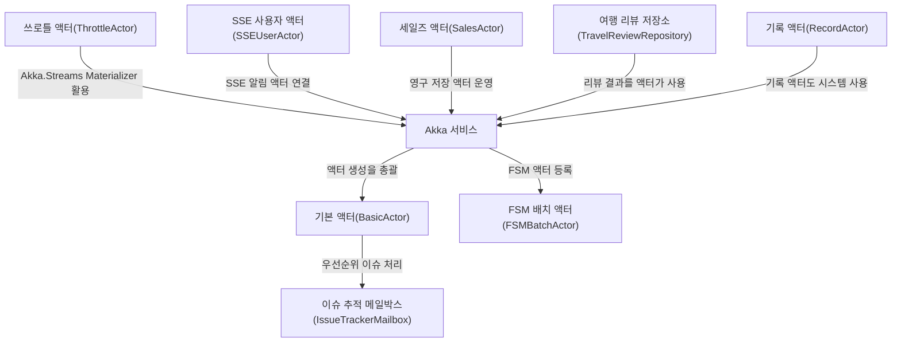

# Tutorial: NetCoreLabs

이 프로젝트는 **액터(Actor) 기반**으로 메시지를 주고받아 *동시성과 분산 처리*를 간편하게 실현하는 예시들을 모아둔 것이다.  
각 액터는 **독립된 동작**과 *메시지 수신*을 통해 서로 간섭 없이 협업하며, 필요에 따라 메일박스 우선순위, *유한 상태 기계(FSM)*, **쓰로틀(Throttle)**, *SSE* 알림, 영구 저장 등 다양한 기능을 적용할 수 있다.  
이를 통해 **안정적이고 확장 가능한 시스템** 구성을 학습하고, 실무 환경에서 *유연하게 메시지를 처리*하는 방법을 예시로 보여준다.

**Source Repository:** [None](None)

## Chapters

1. [Akka 서비스
](01_akka_서비스_.md)
2. [기본 액터(BasicActor)
](02_기본_액터_basicactor__.md)
3. [이슈 추적 메일박스(IssueTrackerMailbox)
](03_이슈_추적_메일박스_issuetrackermailbox__.md)
4. [FSM 배치 액터(FSMBatchActor)
](04_fsm_배치_액터_fsmbatchactor__.md)
5. [쓰로틀 액터(ThrottleActor)
](05_쓰로틀_액터_throttleactor__.md)
6. [SSE 사용자 액터(SSEUserActor)
](06_sse_사용자_액터_sseuseractor__.md)
7. [세일즈 액터(SalesActor)
](07_세일즈_액터_salesactor__.md)
8. [여행 리뷰 저장소(TravelReviewRepository)
](08_여행_리뷰_저장소_travelreviewrepository__.md)
9. [기록 액터(RecordActor)
](09_기록_액터_recordactor__.md)

---

Generated by [AI Codebase Knowledge Builder](https://github.com/The-Pocket/Tutorial-Codebase-Knowledge)