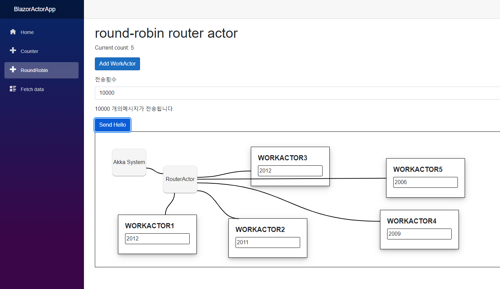

# NetCoreLabs

NetCore기술을 활용하여 Reactive Stream이라는 주제를 주로 다루는 연구프로젝트로

다음과 같이 구성되어 있습니다.

## ActorLib

akka.net(https://getakka.net/)을 이용하여 유용한 액터모델샘플을 지속 발굴하는 학습 프로젝트입니다.

akka가 아니여도 주변기술을 이해하고 스트림으로 처리하는 메시지패턴을 연구하는것에 더 가치를 두고 있습니다.

분산처리를 다루는 개발자가 AKKA를 학습하면 도움되는 이유 : https://wiki.webnori.com/pages/viewpage.action?pageId=94240770


### 기본액터
```
    public class BasicActor : ReceiveActor
    {
        private readonly ILoggingAdapter logger = Context.GetLogger();

        private IActorRef testProbe;

        public BasicActor()
        {

            ReceiveAsync<IActorRef>(async actorRef =>
            {
                testProbe = actorRef;
            });

            ReceiveAsync<string>(async msg =>
            {
                //TODO Something
            });
        }
    }
```

## ActorLibTest

실시간으로 발생하는 메시징을 유닛테스트화하여 실제작동하는 기반으로 흐름을 파악하고 기능을 검증할수 있습니다.
보너스로 성능측정(https://nbench.io/) 툴을 활용하는 방법을 알수 있습니다.
인터넷에 수많은 고성능 분산처리를위한 아키텍처가 늘려있지만 작동가능하고 실천가능한 아키텍처를 만드는것에 가치를 두고 있습니다.


### 성능검증 포함 유닛테스트
```
[Theory(DisplayName = "테스트 n초당 1회 호출제약")]
[InlineData(5, 1, false)]
public void ThrottleLimitTest(int givenTestCount, int givenLimitSeconds, bool isPerformTest)
{
.......
  // Create ThrottleLimit Actor
  throttleLimitActor = actorSystem.ActorOf(Props.Create(() => new ThrottleLimitActor(1, givenLimitSeconds, 1000)));
  throttleLimitActor.Tell(new SetTarget(probe))
   
  for (int i = 0; i < givenTestCount; i++)
  {
      throttleLimitActor.Tell(new EventCmd()
      {
          Message = "test",
      });
  }
   
  //Then : Safe processing within N seconds limit
  for (int i = 0; i < givenTestCount; i++)
  {
      probe.ExpectMsg<EventCmd>(message =>
      {
          Assert.Equal("test", message.Message);                       
      });
   
      output.WriteLine($"[{DateTime.Now}] - GTPRequestCmd");
   
      if (isPerformTest)
      {
          _dictionary.Add(_key++, _key);
          _addCounter.Increment();
      }
  }
...........
}

[NBenchFact]
[PerfBenchmark(NumberOfIterations = 3, RunMode = RunMode.Throughput,
RunTimeMilliseconds = 1000, TestMode = TestMode.Test)]
[CounterThroughputAssertion("TestCounter", MustBe.LessThanOrEqualTo, 1.0d)]
[CounterTotalAssertion("TestCounter", MustBe.LessThanOrEqualTo, 1)]
[CounterMeasurement("TestCounter")]
public void ThrottleLimitPerformanceTest()
{
    ThrottleLimitTest(1, 1, true);
}
```


## BlazorActorApp

Blazor를 통해 액터모델이 웹과 연계되어 작동되는 샘플들을 만드는 프로젝트입니다.
액터모델을 동적으로 생성할수 있는 노코딩으로 구성가능한 액터시각화 활동도 포함되어 있습니다.

### DockerBuild

```
docker build -f BlazorActorApp/Dockerfile -t registry.webnori.com/blazor-actor:dev .

docker push registry.webnori.com/blazor-actor:dev


### SSE
- https://www.codemag.com/Article/2309051/Developing-Real-Time-Web-Applications-with-Server-Sent-Events-in-ASP.NET-7-Core

version: '2'
services:
  blazoractor:
    image: registry.webnori.com/blazor-actor:dev
    environment:
      ASPNETCORE_ENVIRONMENT: "Development"
    ports:
    - 5000:80/tcp
    labels:
      io.rancher.scheduler.affinity:host_label: server_name=main
      io.rancher.container.hostname_override: container_name


```
### Secutity Test



### Demo
- [NetCoreLabs PlayGound](https://code.webnori.com/)


